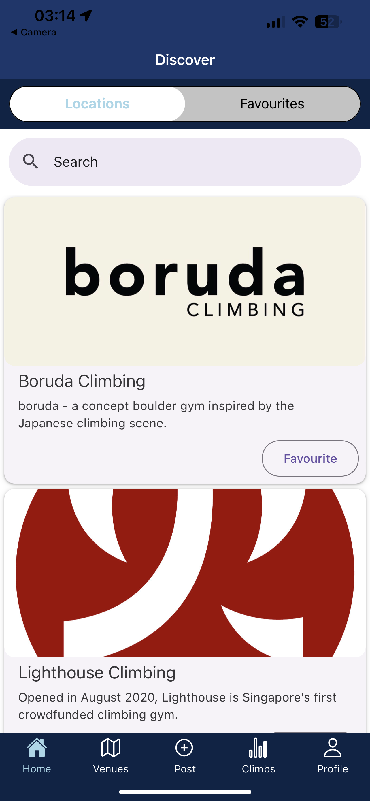
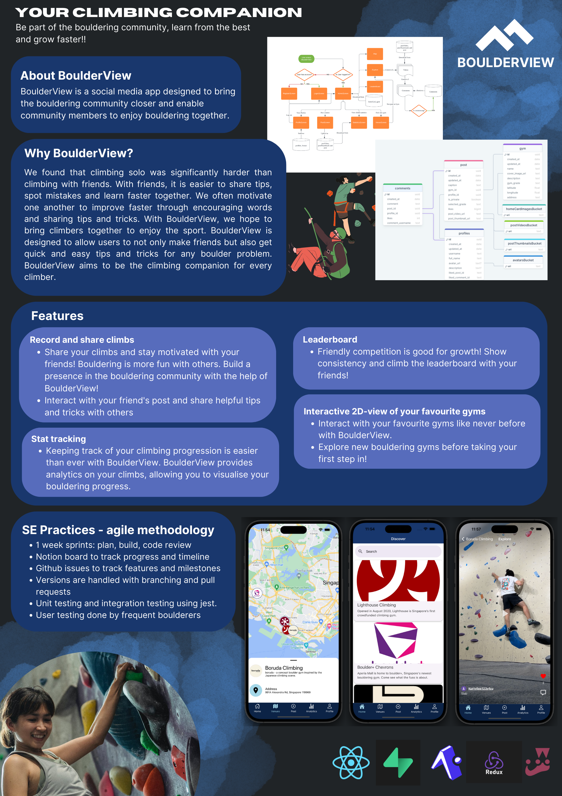

<h1 align="center">BoulderView - Your Climbing Companion</h1>

  
   
  

# About BoulderView
BoulderView is a social media app designed to allow climbers to connect and be part of the bouldering community. BoulderView is designed to motivate climbers to grow together. BoulderView has attained an Orbital achievement of Apollo 11. Try out BoulderView [here](https://github.com/BoulderView/BoulderView/releases/tag/v1.0) and view our documentation [here](https://docs.google.com/document/d/1QLNPyh0o4ubs_PH4ksNkZdLIuUT5X7YY4h-4ZB4-qOI/edit?usp=sharing)!

- Main collaborators are [Kurt](https://github.com/Kurtyjlee) and [Zheng Jing](https://github.com/leezhengjing?tab=repositories)

# Features
- 🌱 A social media app dedicated to climbers to upload and share their climbs with fellow climbers
- 👨‍💻 A stat tracker to track your climbing sessions and record your best climbs
- 👨‍👩‍👦‍👦 A platform for a more personal and immersive climbing experience.

# User Stories
The typical climber
1. As a climber, I would be able to receive help by seeing how other climbers tackle a problem I am facing difficulty with and learn new techniques from my peers.
2. As a climber, I would be able to meet new people through the app and grow with them.
3. As a climber, I would be able to build a presence in the climbing community through the app.
4. As a climber with limited time, I want to be able to preview the climbing routes before even entering the gym so that I can plan my climbing better.
5. As a climber I would be motivated if I could share my climbs with people and receive likes and comments on my climbs.
6. As a climber I would like to be able to look back at my climbs in the past so that I can see my progress as a climber.
7. As a climber, I would be able to track my climbing progress and better plan my climbing training. 

Climbing gyms in Singapore
1. As a climbing gym, I would be able to entice newcomers to experience the gym facilities.
2. As a climbing gym, I would be able to build a community through the app and bring people together.

# Design and development
View our Figma mockup here:
- Colour Scheme: 
- Figma Mockup: [figma](https://www.figma.com/file/y2II0rb3txuoqI8GATHsVM/BoulderView-UI?type=design&node-id=0-1)

# Poster

## Other links
[Video](https://drive.google.com/file/d/1MBxvO7LUAAjxHNn9LA1nXagAq97cxGc_/view)
